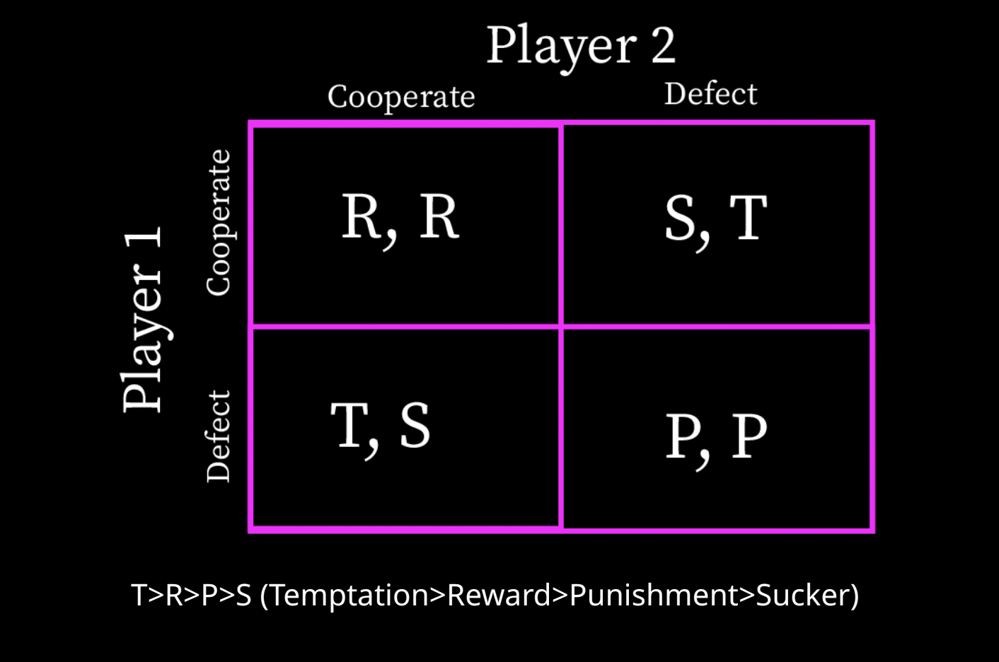

## Introduction

In this week’s blog, I look at decision making and the way in which cooperation occurs between two parties. The importance of cooperation can be traced through an evolutionary lens. According to Axelrod, “Many of the benefits sought by living things are disproportionately available to cooperating groups” (pg. 92). Axelrod is asserting that psychological traits favoring cooperation were favored through natural selection, indicating humans today should lean toward cooperation when possible. However, despite these traits, cooperation often fails to prevail in situations, often those resembling the “Prisoners’ Dilemma”.

### Axelrod and the Prisoners’ Dilemma

In the Prisoner’s Dilemma, two players have the option to either cooperate or defect. The possible outcomes can be visualized in the grid below:

When both players cooperate, there is a win-win scenario. If player 1 cooperates and player 2 defects, player 1 wins big, and vice-verse. This type of framework can be applied to numerous social dilemmas, such as voting. If everyone votes, then each person has the opportunity for their beliefs to be represented. If a person does not vote, they have no representation, and other people’s vote can have more likelihood of influence. If no one votes, then representation is lacking for everyone.

Cooperation leads a to favorable outcome for both, but defecting can be more appealing. Axelrod explores the different strategies humans take in prisoner’s dilemma akin situations to get the most wins or favorable outcomes. He invited game theorists to create a computer program with a strategy that would win the most points. He then pitted each strategy with another in a tournament style of prisoner’s dilemma games to assess the “best” strategy.

Axelrod found that being nice (cooperating) is often the best strategy in repeated games. This is because of the “shadow of the future” in which repeated interactions influence one’s decision to cooperate.

In this blog, I consider 6 of the strategies used in the tournament and simulate games between each strategy.

The strategies are listed below:

## Strategies

| Variable Name | Variable Description                                                                                                                                                                                                                                                                                                           |
|---------------|--------------------------------------------------------------------------------------------------------------------------------------------------------------------------------------------------------------------------------------------------------------------------------------------------------------------------------|
| `backstabber` | 1\. Cooperates until the opponent defects 3 times. 2. Defects forever after that. 3. Always defects in the last 2 rounds                                                                                                                                                                                                       |
| `cooperator`  | 1\. Cooperates systematically.                                                                                                                                                                                                                                                                                                 |
| `foolMeOnce`  | 1\. Cooperates the first time it plays a new opponent. 2. Keeps cooperating after the first defection of the opponent. 3. Defects systematically after the opponent defects a second time.                                                                                                                                     |
| `forgiver`    | 1\. Cooperates the first time it plays a new opponent. 2. After that, defects if opponent has defected more than 10% of the time.                                                                                                                                                                                              |
| `grumpy`      | 1\. Cooperates at first. 2. Each time the opponent defects, increases its level of grumpiness. 3. Each time the opponent cooperates, decreases its level of grumpiness. 4. If grumpiness level is above a threshold A, defects systematically. 5. If grumpiness level returns below a threshold B, cooperates again. 6. A \> B |
| `random`      | 1\. Cooperates or defects at random                                                                                                                                                                                                                                                                                            |

## Data

The data used in the blog is the outcome of the games. For each game, the strategies playing one another are listed (`player1` and `player2`), the scores for each player (`score1`, `score2`), and the outcome of the game (`winner`). There was a total of 21 games. Each strategy played the other strategies (15 games) and itself (6 games). The scores are the sum of 100 rounds with 100 simulations for each round. The maximum score for both players is 6 points for each round, 600 total points.

## Game Results

The chart below displays the outcome of each game.

Note: Reciprocals of the games are shown. Player order does not matter, so game results are shown twice.

}}index_files/figure-html/unnamed-chunk-4-1.png" width="672" />

In the chart above, the middle section is primarily purple, indicating a `tie`. For all strategies except `backstabber` and `random`, 4/6 games ended in a tie. For `backstabber`, the strategy won 5/6 games.

Another way to analyze this data is through the barplot below that illustrates the number of games that resulted in each type. Strategies not shown in the graph indicate that strategy did not win a game.

}}index_files/figure-html/unnamed-chunk-6-1.png" width="672" />

From the heatmap and the barplot, we see that most games (11/21) resulted in a `tie`. Among the strategies, `backstabber` won the most games (5/21) and `forgiver` and `foolMeOnce` were the stratgies that won only 1 game. `Grumpy`, `cooperator`, and `cooperator` were the strategies that did not win any games.

## Scores

}}index_files/figure-html/unnamed-chunk-8-1.png" width="672" />

From these charts, it is obvious that all strategies score the most points when they play themselves. To assess which strategy received the most scores on average, I averaged the scores, not including the games the strategy played itself.

<table class="gt_table" data-quarto-disable-processing="false" data-quarto-bootstrap="false">
  <thead>
    <tr class="gt_heading">
      <td colspan="3" class="gt_heading gt_title gt_font_normal gt_bottom_border" style>Average Score For Each Strategy</td>
    </tr>
    &#10;    <tr class="gt_col_headings">
      <th class="gt_col_heading gt_columns_bottom_border gt_left" rowspan="1" colspan="1" scope="col" id="Player">Player</th>
      <th class="gt_col_heading gt_columns_bottom_border gt_right" rowspan="1" colspan="1" scope="col" id="Average Score">Average Score</th>
      <th class="gt_col_heading gt_columns_bottom_border gt_right" rowspan="1" colspan="1" scope="col" id="Standard Deviation">Standard Deviation</th>
    </tr>
  </thead>
  <tbody class="gt_table_body">
    <tr><td headers="player" class="gt_row gt_left">backstabber</td>
<td headers="avg_score" class="gt_row gt_right">301.424</td>
<td headers="sd_score" class="gt_row gt_right">5.760111</td></tr>
    <tr><td headers="player" class="gt_row gt_left">cooperator</td>
<td headers="avg_score" class="gt_row gt_right">268.908</td>
<td headers="sd_score" class="gt_row gt_right">66.220709</td></tr>
    <tr><td headers="player" class="gt_row gt_left">foolMeOnce</td>
<td headers="avg_score" class="gt_row gt_right">297.872</td>
<td headers="sd_score" class="gt_row gt_right">2.953290</td></tr>
    <tr><td headers="player" class="gt_row gt_left">forgiver</td>
<td headers="avg_score" class="gt_row gt_right">298.010</td>
<td headers="sd_score" class="gt_row gt_right">2.819663</td></tr>
    <tr><td headers="player" class="gt_row gt_left">grumpy</td>
<td headers="avg_score" class="gt_row gt_right">282.624</td>
<td headers="sd_score" class="gt_row gt_right">35.594759</td></tr>
    <tr><td headers="player" class="gt_row gt_left">random</td>
<td headers="avg_score" class="gt_row gt_right">165.638</td>
<td headers="sd_score" class="gt_row gt_right">151.151877</td></tr>
  </tbody>
  &#10;  
</table>

The chart demonstrates `backstabber` had the highest average score and `random` had the lowest. When looking at standard deviations, `foolMeOnce` had the lowest standard deviation and then `backstabber`. This scores show that `backstabber` had the highest score and a relatively low standard deviation, suggesting this analysis is not drawn from outliers.

## Discussion

When considering these results in comparison to Axelrod’s, the primary difference is that Axelrod concludes “being nice” and cooperating is the best way to have expected success. My results had `backstabber` with the highest and `cooperator` as the second highest. This appears to follow Axelrod’s theory because `backstabber` cooperates until the opponent defects three times. In Axelrod’s tournament, tit-for-tat wins (pg. 31). This strategy, although not tested, uses the strategy of cooperating first and then mimicking the opponents’ moves after that. This strategy is similar to `backstabber` because both start with cooperating and then defect once its obvious the opponent has similar intentions of defecting.

Looking at the rest of the table, the top five strategies all start with cooperation and begin to defect more often once the opponent defects. This follows Axelrod’s “be nice” until it no longer benefits you pillar. The strategy that fared the worst was `random`. This appears to make sense because `random` is randomly selecting to cooperate or defect, making it difficult for the opponent to predict their move and decreases their opponent’s desire to cooperate with them.

In Axelrod’s study he has each strategy play each study, it’s own, and `random`. This is similar to my simulation because `random` is one of the strategies I chose. Aside from the size of the simulation (number of games), another difference is with how scores are reported. I chose to not include the results from each strategy playing its “twin”, as described through barplots in the “Score” section of the blog (pg. 30).

## Implications

Although Prisoner’s Dilemma scenarios arise often in the political space, Alexrod’s theory has some limitations to the real world. For example, in these simulations, each player is operating on an algorithm/formula, which is not the case with humans. Although these formulas may appear rational or logical, that does not always mean humans will act that way. Further, each game was simulated in a closed environment, whereas in the real-world, players may be playing simultaneous games with different opponents. This means that results from one game may spillover into the player’s decisions in another games. Finally, in politics, representatives and officials may be influenced by pressures such as constituent support when making decisions. Cooperation may be the right decision, but a politician may choose to defect if they feel this defection will save their political image.

## References

Axelrod, R. M. (2006). The Evolution of Cooperation. Basic Books, New York. (Chapters 1–5)
