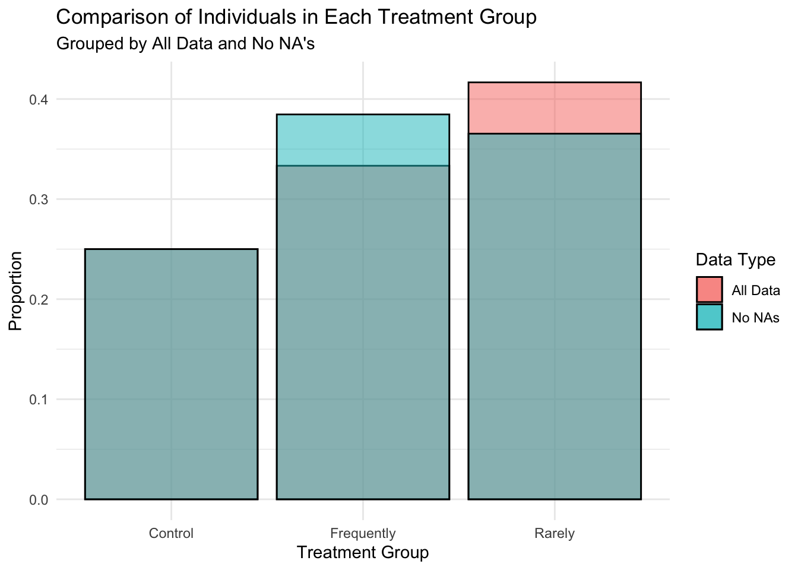
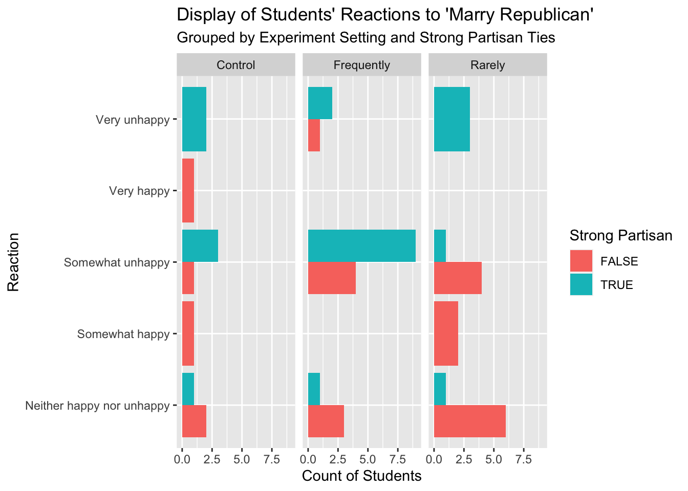
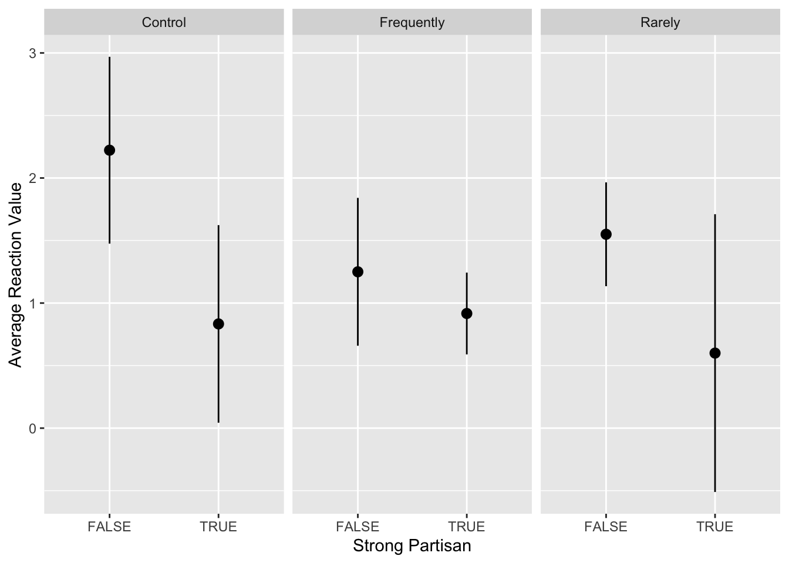
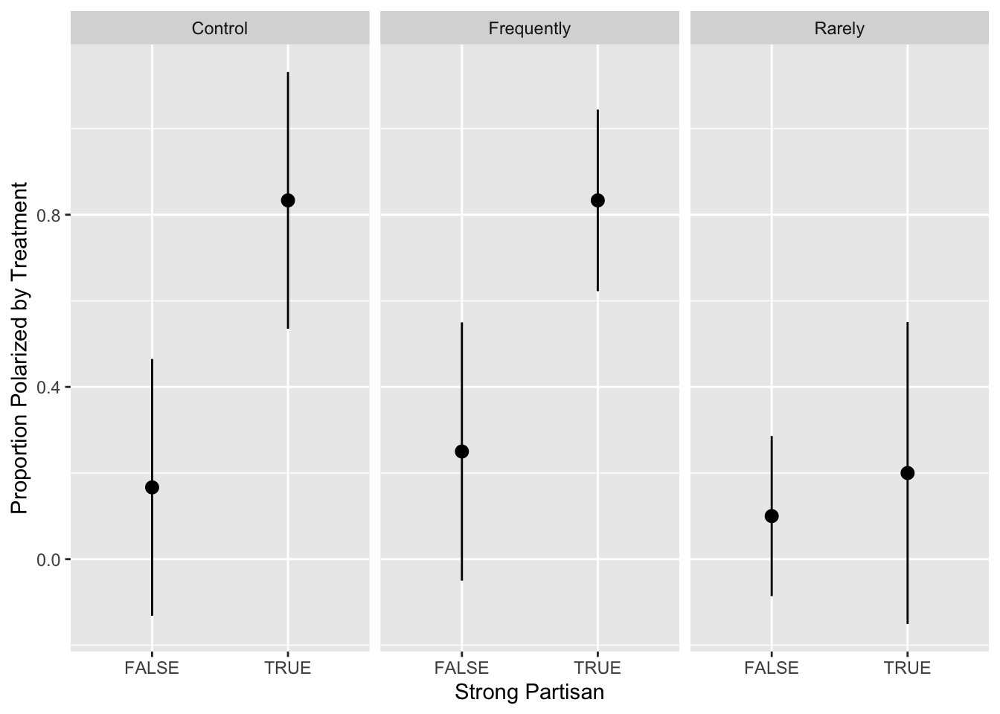

## Introduction:

This week’s blog post considers the role of groups and identities in politics, specifically around party affiliation and the impacts of polarization. The study outlined in the blog serves as a replication of Iyengar, Sood, and Lelkes (2012) study. They seek to find the “proportion upset, displeased, or unhappy, if progeny married someone from another party.” To replicate this study, our class took a survey asking their happiness level (very unhappy to very happy) if their child married a Republican and, similarly, if they married a democrat. One caveat to the survey was that a portion the class received a survey in which they were told the spouse spoke “frequently about their political beliefs”, another survey said “rarely spoke about their political beliefs”, and the third served as the control, not including a statement about speaking habits.

For each individual, their political affiliation was also recorded from past survey results. The driving question for this blog is whether reactions (happiness levels) looked different for weak vs. strong partisans? Strong partisans are those who “identifies as a strong member of either major party.”

## Data:

The data collected in this survey includes 60 entries (individuals) and includes 12 variables. The variables used in this analysis are listed below:

| Variable Name     | Variable Description                                                                                                    |
|-------------------|-------------------------------------------------------------------------------------------------------------------------|
| `treatment`       | Which treatment condition the respondent was randomly assigned to                                                       |
| `marryDemocrat`   | The respondent’s answer to how happy they would be if their child married a Democrat                                    |
| `marryRepublican` | The respondent’s answer to how happy they would be if their child married a Republican                                  |
| `inPartyHappy`    | Indicator variable for whether the respondent would be happy if their child married a member of their own party         |
| `outPartyUnhappy` | Indicator variable for whether the respondent would be unhappy if their child married a member of the other major party |
| `polarized`       | Indicator variable for whether the respondent was effectively polarized                                                 |
| `strongPARTISAN`  | Indicator variable for whether the respondent identifies as a strong member of either major party                       |

In addition to these variables, I created an additional categorical variable, `reaction_value` , which quantifies the happiness levels on a scale of 0-4, where 0 is “Very unhappy” and 4 is “Very happy”. The purpose of converting this scale to numbers is that it allows for numerical analysis (such as averages), that are comparable among groups.

Additionally, it is important to note how `polarized` is defined.`Polarized` is an indicator variable that takes the value “TRUE” if the respondent responded “TRUE” to both `outPartyUnhappy` and `inPartyHappy`, and “FALSE” otherwise.

### Missing Data:

Another important element to the analysis of the data, is understanding where missing data is present. From the graph below, we see that missing data is significantly in the “rarely” treatment group. This means that the proportions of “rarely” are being inflated by missing data. However, when I calculate the proportions of entries in each treatment group, with and without NA’s, there is no discrepancy. The following analyses include all data.

## Marry Republican Reactions:

First, I considered the different reactions to “marry republican” for strong/weak partisans. The reason for looking at just “marry republican” not “marry democrat” is that no student self-reported being republican, and only 4 lean toward the republican party. Although, I do filter the data to only consider Democrats.

From the graph below, we see that for strong partisans, the number of students who reported unhappy sentiments was larger than for weak partisans across almost all treatments (rarely appears to be equal). Conversely, for weak partisans, there does not appear to be that large of different across treatment groups and between reaction types. Although, the neutral reaction received the highest response, by a lot, for weak partisans. Somewhat unhappy was the most common response for strong partisans.

This results allude to that fact that partisan identities appear to be much stronger among strong partisans than weak partisans.

## Average Reaction by Treatment:

This graph uses the numerical categorical variable, `reaction_value` to asses the mean reaction for each group. Lower means indicate unhappy feelings. From the graph, we see that for all treatment groups, strong partisans were more “polarized” than weak partisans because the average reactions were lower. However, looking at the confidence intervals, the overlapping regions for each treatment group, especially “frequently” and “rarely”, indicates that none of these differences appear to be statistically significant. The table below shows the p-values.

The table below shows the p-values. A p-value of `\(p\leq 0.05\)` would mean the results are statistically significant. Only the control appears to have a statistically significant result.

<table class="gt_table" data-quarto-disable-processing="false" data-quarto-bootstrap="false">
  <thead>
    <tr class="gt_heading">
      <td colspan="2" class="gt_heading gt_title gt_font_normal gt_bottom_border" style>P-Values for Each Treatment Group</td>
    </tr>
    &#10;    <tr class="gt_col_headings">
      <th class="gt_col_heading gt_columns_bottom_border gt_left" rowspan="1" colspan="1" scope="col" id="Treatment">Treatment</th>
      <th class="gt_col_heading gt_columns_bottom_border gt_right" rowspan="1" colspan="1" scope="col" id="P.Value">P.Value</th>
    </tr>
  </thead>
  <tbody class="gt_table_body">
    <tr><td headers="Treatment" class="gt_row gt_left">Control</td>
<td headers="P.Value" class="gt_row gt_right">0.008570627</td></tr>
    <tr><td headers="Treatment" class="gt_row gt_left">Rarely</td>
<td headers="P.Value" class="gt_row gt_right">0.076467727</td></tr>
    <tr><td headers="Treatment" class="gt_row gt_left">Frequently</td>
<td headers="P.Value" class="gt_row gt_right">0.274335643</td></tr>
  </tbody>
  &#10;  
</table>

## Proportion Polarized by Treatment:

This next section evaluates the variable `polarized` and considers the proportion of individuals effectively “polarized”, grouped by strong partisanship and treatment group. Similar to the chart above, this graph shows the proportion `polarized` by treatment. We see that strong partisans are significantly more polarized than weak partisans for the control and frequently groups. However, the error bars overlap for rarely, indicating likely lack of statistical significance.

## Discussion:

The results above all appear to come to the conclusion that for strong partisans, political identities are more significant than for weak partisans. We see this through higher polarization scores and lower (more unhappy) reaction scores. Of significance, we see that for the difference of reactions was strongest for the control group. This asserts that the mere idea of one’s child marrying someone from the opposite party is unsettling, even without considering their speaking habits.

The results found in this study correspond to those reported by Iyengar, Sood, and Lelkes (2012) and what is discussed in Iyengar and Westwood (2015). Iyengar, Sood, and Lelkes (2012) find “startling increases in the United States, but not in Britain” for “parents’ displeasure over the prospects of their offspring marrying into a family with a different party affiliation” (Iyengar and Westwood, pg. 691). In their study, the “strong partisans” can be represented by the Americans, whereas, “weak partisans” are analogous to the Brits, who have a lesser degree of party loyalty.

Iyengar and Westwood go on to further prove that partisanship holds a stronger divide in society for in-group and out-group preference than race (pg. 703). They claim that one of the reasons for this is that party’s directly oppose one another, whereas there is not a stark divide/opposition present among races (pg. 704). These conclusions demonstrate how partisanship and affective polarization, creation of in-group and out-group labels, has created an inability for bipartisanship at all levels of society.

At an institutional level, we see the impacts of partisanship more prominently with regard to Congress. Recently, Congress nearly shutdown over a spending bill that lacked [Democratic support](https://www.nytimes.com/2023/09/30/us/politics/government-shutdown-house-republicans.html). With both parties voting as blocks, legislation often passes with only a slight majority, with little space for compromise. On a smaller level, in our class we hypothesized reasons for why the rates of republicans were so small in the class. One idea was out of fear of being marked down by the professor and outed to peers. This view indicates that hostility toward a minority party is common and can seep into many different aspects of society. Although hypothetical, this exercise demonstrated that consciously or not, people’s manner can perpetrate affective polarization and group identity presence.

## References:

<https://www.nytimes.com/2023/09/30/us/politics/government-shutdown-house-republicans.html>

Iyengar, Shanto, Gaurav Sood, and Yphtach Lelkes. 2012. “Affect, Not Ideology: A Social Identity Perspective on Polarization.” Public Opinion Quarterly 76(3): 405–31.

Iyengar, S. and Westwood, S. J. (2015). Fear and Loathing Across Party Lines: New Evidence on Group Polarization.
