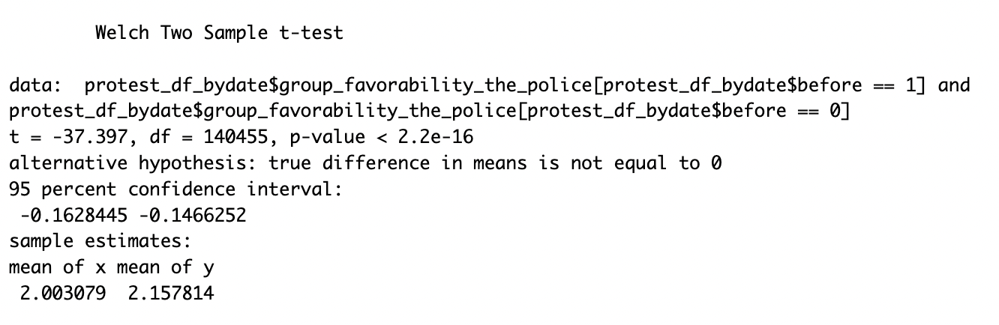
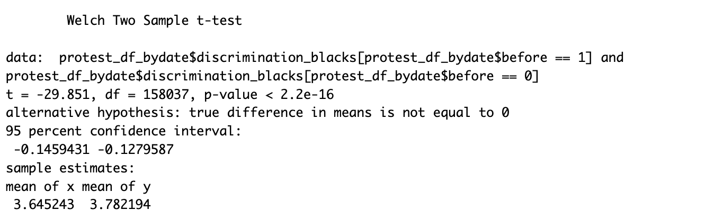
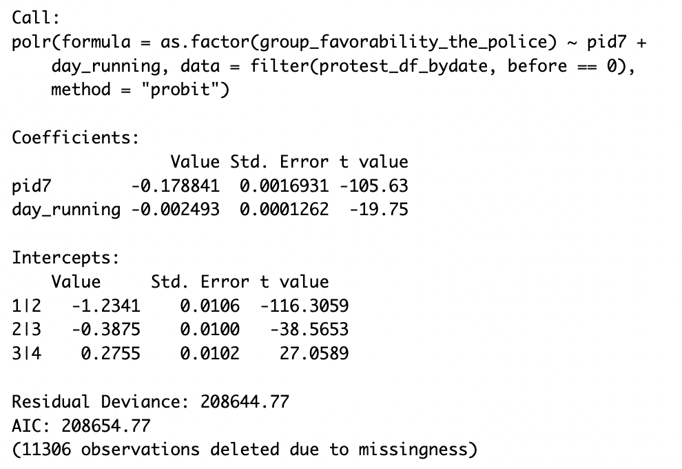

## Introduction:

## Data:

The data utilized in this blog is from Reny and Newman (2021). They "exploit" a survey already "in the field", including when the murder of George Floyd occurred. The survey was a weekly survey assessing individuals ideologies and beliefs toward certain topics, including police favorability and one's perception of the level of discrimination in U.S faced by Black Amercians. The data spans 419 days, from July 18th, 2019 to September 9th, 2020. The data includes 377,507 entries.

A list of key variables utilized in this blog can be found below:

| Variable Name                     | Variable Description                                                                                                                                                                           |
|--------------------------|----------------------------------------------|
| `race_ethnicity`                  | Race or ethnicity. Levels labelled in data: 1-White, 2-Black or AfAm, 3-American Indian or Alaskan Native, 4 through 14- Asian or Pacific Islander (details in labels), and 15-Some other race |
| `hispanic`                        | Of Hispanic, Latino, or Spanish origin. Levels labelled in data: 1-Not Hispanic, 2-15 Hispanic of various origins                                                                              |
| `day_running`                     | Day relative to onset of George Floyd protests (day 0)                                                                                                                                         |
| `pid7`                            | Party identification on a seven point scale with strong, weak, lean: 1-Strong Democrat to 7-Strong Republican with 4-Independent.                                                              |
| `group_favorability_the_police`   | Favorability towards the police: 1-Very favorable, 2-Somewhat favorable, 3-Somewhat unfavorable, 4-Very unfavorable                                                                            |
| `discrimination_blacks`           | Perceptions of the level of discrimination in US faced by Blacks: 1-None at all, 2-A little, 3-A moderate amount, 4-A lot, 5-A great deal                                                      |
| `day`                             | The date the respondent took the survey                                                                                                                                                        |
| `group_favorability_jews`         | Favorability towards Jews: 1-Very favorable, 2-Somewhat favorable, 3-Somewhat unfavorable, 4-Very unfavorable                                                                                  |
| `group_favorability_whites`       | Favorability towards whites: 1-Very favorable, 2-Somewhat favorable, 3-Somewhat unfavorable, 4-Very unfavorable                                                                                |
| `group_favorability_evangelicals` | Favorability towards evangelicals: 1-Very favorable, 2-Somewhat favorable, 3-Somewhat unfavorable, 4-Very unfavorable                                                                          |
| `group_favorability_socialists`   | Favorability towards socialists: 1-Very favorable, 2-Somewhat favorable, 3-Somewhat unfavorable, 4-Very unfavorable                                                                            |

## Comparison in Averages:

### Police:

The results below show the difference in average favorability toward police before the killing of George Floyd and after. From these results we see there is a significant decline in favorability after the killing. This is due to the small p-value and the confidence interval not including zero, allowing us to reject the null hypothesis that there was no relationship between the murder and change in favorability. Looking directly at the means, the mean of x (before the killing) is smaller than the mean of y (after the killing). Favorability of police is coded on a 1-4 scale in which 1 is very favorable and 4 is very unfavorable. Therefore, a postive difference in \~0.15 means that on average, police favoriability decreased by \~0.15.

### Perception of Discrimination Faced By Black Americans

Similar to police favorability, we can assess the average perception of discrimination faced by Black Americans. The results show there was a significant increase in perception of discrimination due to the confidence interval not including zero and a small p-value (reject null hypothesis). The means show that, on average, perception of discrimination increased by \~0.14 before and after the killing of George Floyd. This is because discriminatio is coded on a 1-5 scale, in which higher numbers are associated with higher levels of discrimination.

## Replication of Reny and Newman (2021):

}}index_files/figure-html/unnamed-chunk-5-1.png" width="672" />

## Regression:

<table style="text-align:center"><caption><strong>Regression Results</strong></caption>
<tr><td colspan="2" style="border-bottom: 1px solid black"></td></tr><tr><td style="text-align:left"></td><td><em>Dependent variable:</em></td></tr>
<tr><td></td><td colspan="1" style="border-bottom: 1px solid black"></td></tr>
<tr><td style="text-align:left"></td><td>Politically Motivated</td></tr>
<tr><td colspan="2" style="border-bottom: 1px solid black"></td></tr><tr><td style="text-align:left">Police Favorability</td><td>-0.127***</td></tr>
<tr><td style="text-align:left"></td><td>(0.001)</td></tr>
<tr><td style="text-align:left"></td><td></td></tr>
<tr><td style="text-align:left">Political Ideology</td><td>-0.169***</td></tr>
<tr><td style="text-align:left"></td><td>(0.004)</td></tr>
<tr><td style="text-align:left"></td><td></td></tr>
<tr><td style="text-align:left">Indicator for Date</td><td>2.646***</td></tr>
<tr><td style="text-align:left"></td><td>(0.004)</td></tr>
<tr><td style="text-align:left"></td><td></td></tr>
<tr><td colspan="2" style="border-bottom: 1px solid black"></td></tr><tr><td style="text-align:left">Observations</td><td>326,797</td></tr>
<tr><td style="text-align:left">R2</td><td>0.088</td></tr>
<tr><td style="text-align:left">Adjusted R2</td><td>0.088</td></tr>
<tr><td colspan="2" style="border-bottom: 1px solid black"></td></tr><tr><td style="text-align:left"><em>Note:</em></td><td style="text-align:right">*p<0.1; **p<0.05; ***p<0.01</td></tr>
</table>

## Class Notes:

-   state can have monopoly on legitimate use of force

-   why do people riot/violence?

    -   critque on violence: Sears and McConahay 1973 "The riot is assigned about as much symbolic political meaning as a drunken brawl in a tavern"

    -   when evaluating a complex political object, people rely on symbolic predispositions that were socialized early in life

-   what are symbolic attitudes/positions:

    -   most stable attitudes (stability)

    -   consistent responses over similar attitude objects (constraint)

    -   most influential toward other objects (power)

-   Busing:

    -   attitudes on busing was entirely based on early attitudes

    -   regression shows intolerance has highest coefficient

-   Objects in American Politics that are associated with stable, consistent, and powerful:

    -   constitution

-   longitudinal study demonstrates that group attitudes are powerful and stable and can predict political orientation

-   Sam Huntington: Political Order in Changing Societies:

    -   Mau Mau Uprising (1952-1960), claimed education in the colonies contributed to rioting

-   symbolic and modern racism is based on the racial resentment scale

    -   how can it measure both? attitudes that are socially early and stable and looks at race through both modern (1950s) and old perspectives

-   racial resentment scales:

    -   critique is measures conservatism not racism

## Data Notes:

-   exploit the murder of George Floyd to understand their reaction by evaluating their pre-behaviors

    ## Section Notes:

-   Reny and Newman (2021) argue that instances of social protest against the police such as the 2020 Floyd protests, should exert widespread effects on the police

-   social protest following recent police killings may have little effect

-   comment on the RDD thresholds and differences between baseline for different racial groups

-   symbolic politics means that shocking events would only effect people with less chrystalized

-   
