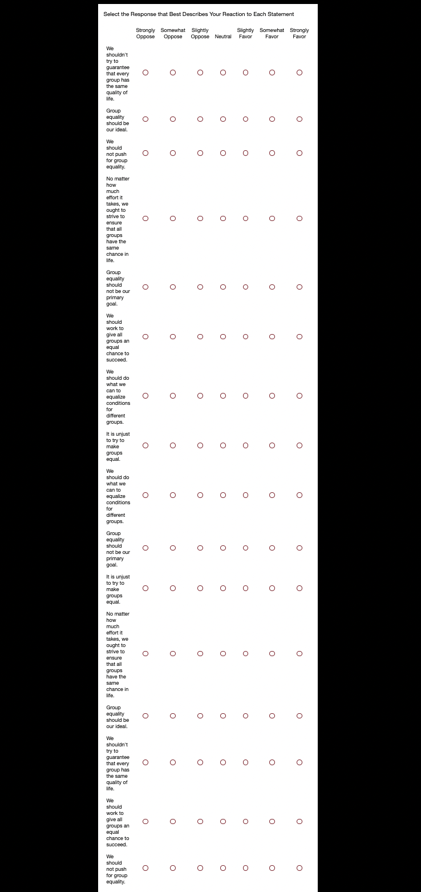

```{r setup, include=FALSE}
knitr::opts_chunk$set(echo=FALSE, warning=FALSE, message=FALSE)
library(dplyr) # filter(), group_by(), summarize
library(readr) # read_csv()
library(ggplot2) # ggplot()
library(estimatr) # difference_in_means()
library(stargazer)
```

```{r, include = FALSE}
## read in data
sdo <- read_csv("sdo_data.csv")
# summary(sdo)
```

## Introduction

This week's blog post considers the role of hierarchies and the idea of social dominance theory. Social dominance orientation (SDO) refers to the "general support for the domination of certain socially constructed groups over other socially constructed groups, regardless of the manner in which these groups are defined" (Sidanious, pg. 61). These groups can greatly vary including different demographic characteristics and belief systems, such as political orientation.

The main question that drives this blog post is to what degree can vote choice be as a function of SDO and other variables of interest? Essentially, this blog uses vote choice as an outcome variable, and evaluates different models, all including SDO, to most effectively analyze the relationship between outcome and selected predictor variables.

## SDO Survey

The usage of SDO in this blog is through a 16 question survey. The picture below displays the survey:



In the replicated survey, I displayed the 16 questions in two groups. Originally the first section of the survey was title "Dominance Sub-Scale" and the second group was titled "Anti-Egalitarianism Sub-Scale." However, I removed these labels so that the participant would not be influenced by the topic of the questions. Further, I randomized the order of the questions in each group with questions from the other group. This way the participant would be more likely to think about their response to each question and not aimlessly respond, repeating their answer from before because the question was similar.

## Data

The data used in this blog is a condensed version of survey conducted and generated by [Data for Progress](%5Bhttps://wthh.dataforprogress.org/get-the-data) in 2018. The data includes 3,144 rows (individuals) and 15 columns. The variables are primarily categorical variables, measuring the individuals' position on different questions with political undertones. The data also includes demographic variables such as race, education, sex, and age. The variables used in this blog are included below:

| Variable Name | Variable Description                                                                                                                                            |
|------------------|------------------------------------------------------|
| `sdo5`        | Five-point social dominance orientation (SDO) scale: 1. Minimum SDO; ...; 5. Maximum SDO                                                                        |
| `female`      | Indicator for whether or not the respondent is female. Coded 1 if respondent is female, 0 otherwise.                                                            |
| `birthyr`     | Respondent's birth year                                                                                                                                         |
| `educ`        | Education: 1. Didn't graduate HS; 2. HS graduate; 3. Some college; 4. 2-year college; 5. 4-year college; 6. Postgraduate                                        |
| `race`        | Race: 1. White; 2. Black or African-American; 3. Hispanic or Latino; 4. Asian or Asian-American; 5. Native American; 6. Mixed Race; 7. Other; 8. Middle Eastern |
| `favor_trump` | Favorability of Donald Trump: 1. very unfavorable; ...; 4. very favorable                                                                                       |
| `favor_blm`   | Favorability of Black Lives Matter: 1. very unfavorable; ...; 4. very favorable                                                                                 |
| `favor_metoo` | Favorability of the Me Too movement: 1. very unfavorable; ...; 4. very favorable                                                                                |
| `pid3`        | Three-category party identification: 1. Democrat; 2. Independent; 3. Republican                                                                                 |
| `ideo5`       | Five-category political ideology: 1. Very liberal; ...; 5. Very conservative                                                                                    |
| `presvote16`  | Vote choice in the 2016 presidential election                                                                                                                   |

## Social Dominance Orientation

Before analyzing the effectiveness of the model, it is important to consider the results from the survey and understand the distribution of SDO in the data set.The density plot below shows the distribution of `SDO` within the data set. The blue line represents the mean and the median in red. We see that both of these lines are very close together, the median is slightly smaller than the mean. Therefore, the average SDO value on a 5 point scale is \~2. However, there appears to be a large spike right at 1 and then a smaller one at 3. This shows that the most common SDO score was 1 and then 3, with an average around 2.

```{r, echo = FALSE}
ggplot(sdo, aes(x=sdo5)) +
  geom_density() +
  geom_vline(xintercept = mean(sdo$sdo5), color="blue") +
  geom_vline(xintercept = median(sdo$sdo5), color="red") +
  labs(title = "Distribution of SDO in Dataset")+
  xlab("Five-point social dominance orientation (sdo5)") +
  ylab("Density")
```

## Social Dominance By Party

Next, the density plots below break down SDO scores by party.

First, looking at the Democrat plot, we see that the most common score rating was dominantly 1. 2 and 3 were next, and there were no 4 or 5s. This indicates a possible connection between lower SDO scores for Democrats.

Looking at the Independent chart, there is a similar trend to the Democrat Chart, but with a lower magnitude. 1,2,3, all have similar densities, 4 has a very small number of people, and 5 has no people.

Finally, looking at the Republican graph, there is a parabolic nature to the density plot, with a maximum value at 3. The density for 3 on this graph is the highest among the three graphs. Similar to the other graphs, there are very few people at 4 and non at 5. The difference between this graph and the other two is that scores 1 and 2 do not have the highest density on the graph.

These three graphs display a possible link between party affiliation and SDO score. As people get more conservative, their SDO score similarly increases.

```{r, echo=FALSE}
sdo_no_na <- sdo %>%
  filter(!is.na(pid3)) %>%
  mutate(pid3 = case_when(pid3 == 1 ~ "Democrat",
                          pid3 == 2 ~ "Independent",
                          pid3 == 3 ~ "Republican")) %>%
  ggplot(aes(x=sdo5)) +
  geom_density() +
  facet_wrap(~pid3) +
  labs(title = "Density Plot of Each Party Affiliation (Pid3) for SDO", x = "Five-point social dominance orientation (sdo5)", y = "Density")

sdo_no_na
```

## SDO and Party Affiliation

The chart below looks at the correlation between SDO score and political affiliation. To measure political affiliation, the variable `favor_trump` is used. This variable goes from 1-4 with 4 being associated with "very favorable". In the chart below, each circle represents a different coordinate of SDO and Trump favorability. The size of the circle corresponds to the proportion of individuals with that score for Trump, among individuals with a certain SDO score. For example, at point (1,1) on the graph, the circle represents the proportion of individuals who no favorability for Trump (1) among those that also have a SDO score of 1.

From the chart, we can see that at scores 1 and 4 for Trump, there is a significant trend among the circles. At score 4, the circles get larger as SDO increases and at score 1, the circles get smaller as SDO increases. This follows the trend noticed in the earlier graphs. As SDO increases, people become more conservative.


```{r}
sdo_stacked_bar <- sdo %>% 
  group_by(sdo5, favor_trump) %>% # First we'll create counts for each group
  summarise(number_cases = n()) %>% 
  group_by(sdo5) %>% # Group new datafram by class
  mutate(total_cases = sum(number_cases),
         proportion = number_cases/total_cases)

ggplot(sdo_stacked_bar, aes(x=sdo5, y=favor_trump)) + 
  geom_point(aes(size=proportion)) +
  labs(title = "Relationship Between Trump Favorability and SDO", 
       subtitle = "Proportion of Individuals at Each Trump Level among SDO Category") +
  ylab("Trump Favorability (0-4)") +
  xlab("SDO") 
  
```

## SDO and Gender
Next, we can consider the distribution of SDO scores by gender. From these graphs we see that women have lower SDO scores than men. The spike at SDO of 1 is significiantly higher for females than males. 

```{r, echo=FALSE}
sdo_gender <- sdo %>%
  filter(!is.na(female)) %>%
  mutate(female = case_when(female == 1 ~ "Female",
                          female == 0 ~ "Male")) %>%
  ggplot(aes(x=sdo5)) +
  geom_density() +
  facet_wrap(~female) +
  labs(title = "Density Plot of Gender for SDO", x = "Five-point social dominance orientation (sdo5)", y = "Density")

sdo_gender
```

## Fitting a Model

After evaluating the relationship between SDO and party affiliation, I created a model with republican votes in the 2016 presidential election the outcome variable. In order to make the model, I first had to add two variables, `white` and `rep_votes`. `white` considers race as binary variable, with "white" being 1 and all other cases as 0. `rep_votes` is also a binary variable, with Trump as 1 and any other candidate 0.

I fit three models and display the results in the table below:

```{r, results='asis'}
# data for progress is left
sdo <- sdo %>%
  mutate(white = case_when(race == 1 ~1,
                            T ~ 0),# all other cases
        rep_votes = case_when(presvote16 == "Trump" ~ 1,
                              presvote16 %in% c("Clinton", "Johnson", "McMullin", "Other", "Stein") ~ 0,
                              presvote16 == "Did not vote" ~ NA_real_))

fit1 <- lm(rep_votes ~ sdo5 + white + educ + age + pid3 + ideo5, sdo)
fit2 <- lm(rep_votes ~ sdo5 + white + female + educ + age + pid3 + ideo5, sdo)
fit3 <- lm(rep_votes ~ sdo5 + white + female + educ + age, sdo)
fit4 <- lm(rep_votes ~ sdo5, sdo)

stargazer(fit4, fit3, fit2, fit1, title="Regression Results", type='html',
          dep.var.labels = "Republican Votes",
          covariate.labels=c("SDO [sdo5]", "Race [white]", "Gender [female]", "Education [educ]", "Age [age]", "Party ID [pid3]", "Ideology [ideo5]"),
          omit.stat = c("f", "ser"),
          out="output.tex")
```

#### Model 1: Just SDO

In the first model, I just look at the predictive power of SDO on republican votes. Importantly, we see that the coefficient for SDO is significant at the 95% confidence interval. This means there is a .304 increase in Trump vote for additional unit increase in SDO. The adjusted R\^2 value is 0.320.

#### Model 2: SDO and Demographics model

The second model considers SDO along with gender, race, education, and age. In this model, all variables are significant at the 95% confidence level except for race. The adjusted R\^2 value is 0.361. This is slightly higher than model 1.

#### Model 3: SDO, Demographics, and Ideology Model

The third model considers all the variables (adding party and ideology). Like model 2, gender is the only variable that is not significantly significant. The adjusted R\^2 for this model is much higher than the other 2 models, 0.680.

#### Model 4: SDO, Demographics (No Gender), and Ideology, Model

The fourth, and final model, removes race from the previous model. Now, all predictors are statistically significant and the adjusted R\^2 value is 0.680.

#### Comparison of Models

Between the four models, the fourth most accurately fits the data because it has the highest adjusted R\^2 value and all variables are statistically significant. Interestingly, Party ID and SDO have the largest coefficients. These means, that when holding all the other variables constant, these variables will have the biggest sway in the outcome variable of republican votes. This makes sense considering how significant party affiliation is for voters and that SDO is connected to political ideology (seen in the earlier sections).

## Discussion

These results have larger implications in the political sphere when considering the role group affiliation has in society. The density graphs and the models demonstrate that SDO is a strong predictor of party affiliation. For Democrats, lower SDO scores tend to dominate, whereas Republicans see higher SDO scores. This means Democrats are less concerned about group identity and more accepting toward those considered in lower or under-represented groups. In fact, this idea was explored in Kteily, Rocklage, McClanahan, and Ho's paper "Political ideology shapes the amplification of the accomplishments of disadvantaged vs. advantaged group members." During the 2016 Olympics, they compared retweeting stats between Democrats and Republicans for gold medalists. They found that liberals were more likely to tweet about Black and female athletes than conservatives (pgs. 1560-1561).

These findings connect to the trends with SDO as gender and race are common group identities. Non-white and females are under recognized and lower class groups in the today's society. Therefore, the tweeting patterns demonstrate conservatives are less inclined to promote these group and remove group biases than liberals. Although this study has limitations, primarily with external validity and extrapolating tweeting patterns to real life, I think the study is fairly legit. With the prominence of social media in everyday life, patterns with tweeting and followers appears to just be an extension a person's life.

Outside of party affiliation, the gender differences in SDO scores discusses in this blog is also corroborated in Each and Crabtree's paper "Gender differences in the prosecution of police assault: Evidence from a natural experiment in Sweden." This natural experiment utilized the random appointment of prosecutors in Sweden to evaluate the probability that a police assault claim will be investigated. They find that "women special prosecutors are around 16 percentage points more likely to investigate police assault in Sweden than their male counterparts" (Eck, Crabtree, pg. 16). Although this study does not identify a mechanism for these results, the study demonstrates that women are more likely to question police violence, which relates to lower SDO scores, as police hold can hold a higher status in society given their power over individuals. 

With regard to current events, we can see SDO scores at play as one of the factors for the removal of House Speaker Kevin McCarthy. One of the major reasons McCarthy was removed from office was for his attempts at reaching across the aisle and passing a [spending-bill with Democratic support](https://www.npr.org/2023/10/04/1203462629/kevin-mccarthy-speaker-matt-gaetz-congress-vote#:~:text=Kevin%20McCarthy%20became%20the%20first%20speaker%20removed%20by%20a%20U.S.%20House%20vote.,-Mandel%20Ngan%2FAFP&text=via%20Getty%20Images-,Kevin%20McCarthy's%20run%20as%20speaker%20was%20relatively%20short%20and%20anything,vote%20to%20vacate%20the%20seat.). Although lack of bipartisanship is strong for both parties, this example demonstrates how McCarthy's decision to concede with the minority and out-group, the Democrats, made him unappealing for Republicans. This low-score SDO act went against the high-score SDO values conservatives typically hold. 

## References

Eck, K. and Crabtree, C. (2020). Gender differences in the prosecution of police assault: Evidence from a natural experiment in Sweden. PLOS ONE, 15(7):1--16.

Kteily, N. S., Rocklage, M. D., McClanahan, K., and Ho, A. K. (2019). Political ideology shapes the amplification of the accomplishments of disadvantaged vs. advantaged group members. Proceedings of the National Academy of Sciences, 116(5):1559--1568.

Sidanius, J. and Pratto, F. (2001). Social Dominance: An Intergroup Theory of Social Hierarchy and Oppression. Cambridge University Press, New York.
