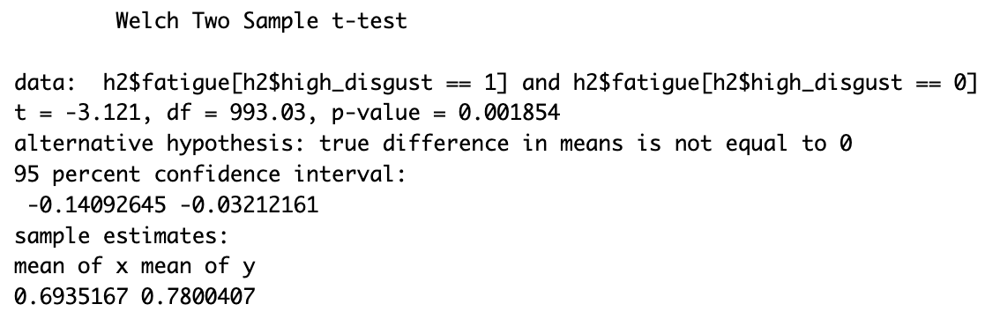
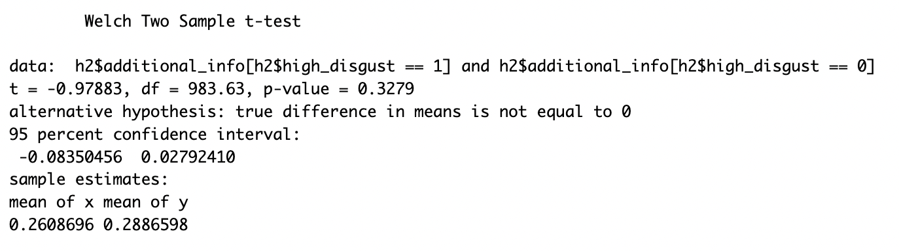

```{r setup, include=FALSE}
knitr::opts_chunk$set(echo = FALSE, warning = FALSE, message = FALSE)
library(tidyverse)
library(estimatr)
library(haven)
library(stargazer)
library(gridExtra)
library(gt)
# install.packages("ltm")
library(ltm)
```

## Introduction

This week's blog looks at the impact of emotions on political behavior, such as anxiety and disgust. This blog replicates Clifford and Jerit's (2018) study, which considers the effects of disgust and anxiety on political behavior. They consider how people react to public health threats, specifically trying to understand how anxiety and disgust play into one's response and the likelihood of being an "informed, activate public" (Clifford and Jerit, 2018, pg. 266).

In order to identify these effects, they provide participants with a fake news headline and blurb about a disease. To manipulate stress, the participants either learn the disease the disease is incredibly dangerous and high transmittable (high stress) or not very serious and low chance of spreading (low stress). To manipulate digust, the symptoms are either traditionally disgusting (diarrhea and boils) or painful (joint pains and headaches). The study then measured ability to correctly identify symptoms and whether they want more information.

Cliford and Jerit have three hypotheses about the impact of anxiety and disgust on information uptake and search:

1.  "An object that induces disgust should increase retention of information related to the source of the emotion" (pg. 267)
2.  "While disgust may improve memory of the source of emotional arousal, it will impair recall of information that is not the primary elicitor of disgust" (pg. 267)
3.  "A person who feels disgusted about a threat will avoid the source of disgust and new information about the topic" (pg. 268)

## Data

In study 1, the data involves 1000 participants. Data is drawn from a YouGov survey between December 14th - 21st, 2015. The data has been cleaned with new variable names.

A few of the key variables are listed below:

| Variable Name         | Variable Description                                                                                                                                                                            |
|--------------------------|----------------------------------------------|
| `treat_rand1`         | Treatment assignment: 1-Low Anxiety/Low Disgust, 2-High Anxiety/Low Disgust, 3-Low Anxiety/High Disgust, and 4-High Anxiety/High Disgust                                                        |
| `disgust`             | Self reported feeling of how well DISGUST describes respondent's emotional reaction to virus: 1-Not Well At All, 2- Not Too Well, 3-Somewhat Well, 4-Very Well, 5-Extremely Well, 8-Skipped     |
| `grossed_out`         | Self reported feeling of how well GROSSED OUT describes respondent's emotional reaction to virus: 1-Not Well At All, 2- Not Too Well, 3-Somewhat Well, 4-Very Well, 5-Extremely Well, 8-Skipped |
| `repulsed`            | Self reported feeling of how well REPULSED describes respondent's emotional reaction to virus: 1-Not Well At All, 2- Not Too Well, 3-Somewhat Well, 4-Very Well, 5-Extremely Well, 8-Skipped    |
| `afraid`              | Self reported feeling of how well AFRAID describes respondent's emotional reaction to virus: 1-Not Well At All, 2- Not Too Well, 3-Somewhat Well, 4-Very Well, 5-Extremely Well, 8-Skipped      |
| `anxious`             | Self reported feeling of how well ANXIOUS describes respondent's emotional reaction to virus: 1-Not Well At All, 2- Not Too Well, 3-Somewhat Well, 4-Very Well, 5-Extremely Well, 8-Skipped     |
| `worried`             | Self reported feeling of how well WORRIED describes respondent's emotional reaction to virus: 1-Not Well At All, 2- Not Too Well, 3-Somewhat Well, 4-Very Well, 5-Extremely Well, 8-Skipped     |
| `fatigue`             | Identification of FATIGUE as a symptom: 1-Yes, 2- No                                                                                                                                            |
| `headaches`           | Identification of HEADACHES as a symptom: 1-Yes, 2- No                                                                                                                                          |
| `diarrhea`            | Identification of DIARRHEA as a symptom: 1-Yes, 2- No                                                                                                                                           |
| `joint_pain`          | Identification of JOINT PAIN as a symptom: 1-Yes, 2- No                                                                                                                                         |
| `boil`                | Identification of BOILS as a symptom: 1-Yes, 2- No                                                                                                                                              |
| `warts`               | Identification of WARTS as a symptom: 1-Yes, 2- No                                                                                                                                              |
| `fever`               | Identification of FEVER as a symptom: 1-Yes, 2- No                                                                                                                                              |
| `look_up`             | Self-reported likelihood of looking up more info: 1-Not likely at all, 2-Not too likely, 3-Somewhat likely, 4-Very likely, 5-Extremely likely, 8-Skipped                                        |
| `share`               | Self-reported likelihood of talking with friends or family about disease in next week: 1-Not likely at all, 2-Not too likely, 3-Somewhat likely, 4-Very likely, 5-Extremely likely, 8-Skipped   |
| `page_article_timing` | Time spent in seconds on page containing article about disease                                                                                                                                  |

```{r, include = FALSE}
## data processing
Study1_preprocess <- read_dta("Study1ReplicationData.dta")

Study1_processing1 <- Study1_preprocess |> 
  rename_with(.cols = c(Q13, Q14, Q15), ~c("disease_transmission", "cure", "additional_info"))

Study1_processing2 <- Study1_processing1 |> 
  rename_with(.cols = last_col(offset = 5):last_col(), ~c("gender", "race", "education", "party_id", "voter_reg", "ideo"))

Study1_processing3 <- Study1_processing2 |> 
  rename_with(.cols = contains("Q11"), ~c("disgust", "grossed_out", "repulsed", "afraid", "anxious", "worried")) %>% 
  rename_with(.cols = contains("Q12"), ~c("fatigue", "headaches", "diarrhea", "joint_pain", "boils", "warts", "fever")) %>% 
   rename_with(.cols = contains("Q17"), ~c("look_up", "share"))

Study1_processing4 <- Study1_processing3 |> 
  dplyr::select(-contains("Q16_"))

Study1_processing5 <- Study1_processing4 |>
  mutate(across(.cols = everything(),~na_if(.,8)))

Study1_processing6 <- Study1_processing5 %>% 
  mutate(across(.cols = c(fatigue, headaches, diarrhea, joint_pain, boils, warts, fever, cure, additional_info, voter_reg),
                ~ifelse(. == 1, 1, 0)))

Study1_processing7 <- Study1_processing6 %>% 
  mutate(sympt_correct = case_when(treat_rand1 %in% c(1,2) ~ 
                                     ifelse(as.numeric( paste0(fatigue, headaches,
                                                               diarrhea, joint_pain, 
                                                               boils, warts,
                                                               fever))== 1101000, 1,0),
                                   treat_rand1 %in% c(3,4) ~
                                     ifelse(as.numeric(paste0(fatigue, headaches,
                                                              diarrhea, joint_pain,
                                                              boils, warts, 
                                                              fever))== 1010100, 1,0)))
```

## Treatment Conditions

-   1: Low Anxiety/Low Disgust

    -   Disease has low transmission rates and symptoms are just painful (joint pains and headaches and fatigue)

-   2: High Anxiety/Low Disgust

    -   Disease has high transmission rates and symptoms are just painful (joint pains and headaches and fatigue)

-   3: Low Anxiety/High Disgust

    -   Disease has low transmission rates and symptoms are "disgusting" (boils and warts and fatigue)

-   4: High Anxiety/High Disgust

    -   Disease has low transmission rates and symptoms are "disgusting" (boils and warts and fatigue)

## Manipulation Check

Before running more in-depth analyses understanding to the impacts of anxiety and disgust, it is important to make sure the manipulation of inducing anxiety and disgust was successful.

This means treatment groups 3 and 4 should have the highest levels of disgust and treatment groups 2 and 4 should have the highest levels of anxiety.

The table below shows that this true. The difference appears to be especially clear for disgust. The highest anxiety level is for group 2 (high anxiety and low disgust). The highest disgust level is for group 4 (high anxiety and high disgust). These results are consistent with the findings from Clifford and Jerit (2018).

```{r, include=FALSE}
treatment_numbers <- Study1_processing7 %>% 
  group_by(treat_rand1) %>% 
  summarise(`Avg. Anxiety` = mean(anxious, na.rm = TRUE),
           `Avg. Disgust` = mean(disgust, na.rm = TRUE))
```

```{r}
gt(treatment_numbers) %>%
  tab_header(
    title = md("**Average Anxiety and Disgust Based on Treatment Group**")
  ) 

```

## Cronbach's Alpha:

Cronbach's alpha is a measure of how internally consistent the answers to multiple questions are. This is an important measure when using indexes of multiple measures aimed at a single concept.

The formula is shown below:


### Anxiety

The results below the show the Cronbach's alpha for disgust. The Cronbach's alpha below 0.7 are regarded as insufficiently internally consistent.

The Cronsbach's alpha is: 0.917 (highly consistent)

```{r, include = FALSE}
Study1 <- Study1_processing7 |> mutate(disgust_treat = ifelse(treat_rand1<=2,0,1))

disgust <- Study1_processing7 |> dplyr::select(disgust, grossed_out, repulsed)  %>% 
  drop_na()

anxiety <- Study1_processing7 |> dplyr::select(afraid, anxious, worried) %>% 
  drop_na()


c_disgust <- cov(disgust$disgust, disgust$grossed_out, use = "complete.obs") +
  cov(disgust$disgust, disgust$repulsed, use = "complete.obs") +
  cov(disgust$repulsed, disgust$grossed_out, use = "complete.obs")

v_disgust <- var(disgust$disgust, use = "complete.obs") +
  var(disgust$grossed_out, use = "complete.obs") +
  var(disgust$repulsed, use = "complete.obs")

c_anxiety <- cov(anxiety$afraid, anxiety$anxious, use = "complete.obs") +
  cov(anxiety$afraid, anxiety$worried, use = "complete.obs") +
  cov(anxiety$worried, anxiety$anxious, use = "complete.obs")

v_anxiety <- var(anxiety$afraid, use = "complete.obs") + var(anxiety$anxious, use = "complete.obs") + var(anxiety$worried, use = "complete.obs")

```

```{r, error=TRUE, include=FALSE}
# cronbach.alpha(data=anxiety, na.rm = TRUE)
```


### Disgust

The Cronbach's alpha is: 0.932 (highly consistent, more so than anxiety)

```{r, error=TRUE, include = FALSE}
# cronbach.alpha(data=disgust, na.rm = TRUE)
```


## Modeling Correct Symptoms

Before getting into the results of the hypotheses, I create a multivariate linear regression, modeling the likelihood of identifying correct symptoms based on how long an individual spends reading the article, their party affiliation, and education level.

The regression table below shows the results. Time spent reading is the only variable that is significant, but only at the 90% confidence level. This means that for every one unit increase in time spent reading, there is a .0001 increase in likelihood of identifying correct symptoms, holding all other variables constant.

```{r, results = 'asis'}
lm1 <- lm(data = Study1, sympt_correct ~ page_article_timing + party_id + education)
stargazer(lm1, title="Regression Results", type='html',
          dep.var.labels = "Correct Symptoms",
          covariate.labels=c("Time Spent Reading", "Party ID", "Education"),
          omit.stat = c("f", "ser"),
          out="output.tex")
```

The plot below shows that none of the variables are statistically significant at the 95% confidence level because 0 is included in the confidence interval.

```{r}
#Collate upper and lower bounds + estimate
Study1Plot <- as.data.frame(cbind(confint(lm1), lm1$coefficients))

colnames(Study1Plot) <- c("lowbound", "upbound", "estimate")

Study1Plot$coef <- rownames(Study1Plot)


#Make the Plot
ggplot(data=Study1Plot[-1,], mapping=aes(x=coef, y=estimate, ymin=lowbound, ymax=upbound)) + geom_pointrange() + geom_hline(yintercept = 0, linetype = 'dashed') +

coord_flip() + xlab('Coefficients') +
ylab('Treatment Effect (with 95% CI)')
```

## Evaluating the Hypotheses:

### Hypothesis 1

Hypothesis 1 states that "an object that induces disgust should increase retention of information related to the source of the emotion" (pg. 267). This can be assessed through analyzing the percentage of individuals who correctly identified the correct symptoms for high disgust and low disgust groups.

The t-test below shows that there is \~ 0.04 average increase in correct symptom recollection, but the results are statistically insignificant. This is different from Clifford and Jerit (2018) because they control for anxiety. Their results find that in people in the high disgust condition were more "likely to remember both symptoms than respondents in the low disgust condition (70% vs. 61%, \~ 10 percentage points)" (pg. 270). There results are significant at the 90% confidence level. Their results confirm hypothesis 1.

```{r, include = FALSE}
h1 <- Study1_processing7 %>% 
  mutate(high_disgust = ifelse(treat_rand1 >= 3, 1, 0))


# t.test(x=h1$sympt_correct[h1$high_disgust == 1], 
#        y=h1$sympt_correct[h1$high_disgust == 0])


```

{width="700"}

### Hypothesis 2

Hypothesis 2 states that "while disgust may improve memory of the source of emotional arousal, it will impair recall of information that is not the primary elicitor of disgust" (pg. 267). To test this, we can compare likelihood of reporting fatigue as a symptom. Fatigue is one of the symptoms reported for all conditions, so not identifying this as a symptom would indicate "impaired recall of information", regardless of the treatment condition.

The t-test below shows that in high disgust situations, people are 10 percentage points less likely to identify fatigue as a symptom. In low digust conditions, 78% correcelty identify fatigue as a symptom, but in high disgust conditions, this drops to 69%. This results are statistically significant and consistent with the findings in Clifford and Jerit (2018).

```{r, include = FALSE}
h2 <- Study1_processing7 %>% 
  mutate(high_disgust = ifelse(treat_rand1 >= 3, 1, 0))

# t.test(x=h2$fatigue[h2$high_disgust == 1],
#        y=h2$fatigue[h2$high_disgust == 0])
```

{width="700"}

### Hypothesis 3

The third hypothesis states that "a person who feels disgusted about a threat will avoid the source of disgust and new information about the topic" (pg. 268). To test this hypothesis, I consider the variable `additional_info`, which indicates whether a participant sought out additional information. My analysis shows the results are statistically insignificant, however, Clifford and Jerit (2018) perform a more robust analysis for hypothesis 3. They consider 4 different variables assessing information search. They found that "disgust generated a qualitatively different reaction than did anxiety---one of avoidance rather than engagement." Specifically, "anxiety increased informationsearch only in the absence of disgust" (pg. 272). This means that among the emotions, anxiety is the best predictor for understanding if a person will seek additional information.

```{r, include = FALSE}
# t.test(x=h2$additional_info[h2$high_disgust == 1],
#        y=h2$additional_info[h2$high_disgust == 0])


```

{width="700"}

## Discussion

The results in this blog have shown that

## References

Clifford, & Jerit, J. (2018). Disgust, Anxiety, and Political Learning in the Face of Threat. American Journal of Political Science, 62(2), 266--279. <https://doi.org/10.1111/ajps.12350>
